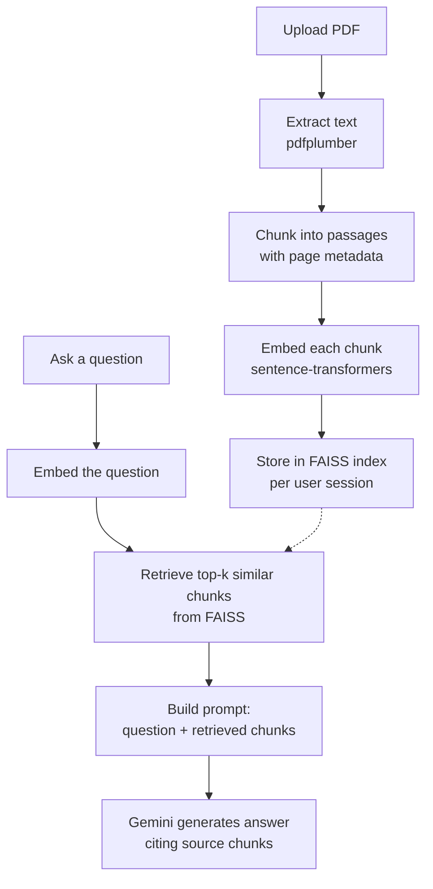

# 📚 Study Buddy

A NotebookLM-style RAG (Retrieval-Augmented Generation) app that lets you upload your own class notes and textbook PDFs, then ask questions and get answers **grounded in and cited from your actual documents** — no hallucinated facts, no generic textbook answers.

## 🔗 [Try it live: study-buddy-jcw6.onrender.com](https://study-buddy-jcw6.onrender.com)

**How to use it:**
1. Open the link above.
2. Click **Choose File**, pick a PDF (class notes, a textbook chapter, etc.), then click **Upload PDF**.
3. Once it's processed, type a question about the document in the box at the bottom and hit **Send**.
4. The answer will be grounded in your PDF, with citations pointing back to the source page.

> ⚠️ Hosted on a free tier: the first request after a period of inactivity can take 30–60s to wake up. Works best with small-to-medium PDFs — see [Known Limitations](#known-limitations--whats-next) below.

---

## Why I built this

I wanted my first real end-to-end AI project to be something I use myself: studying from my own notes with an assistant that only answers from *those* notes, and shows me exactly where each answer came from — instead of a general chatbot that might make things up. Beyond the app itself, my real goal was to learn what "shipping" actually means: not just getting a model to work in a notebook, but building an API, containerizing it, and getting it live on the internet — including debugging the parts that only show up once real infrastructure is involved.

---

## How the RAG pipeline works

RAG solves a simple problem: an LLM on its own doesn't know what's in *your* PDF, and asking it to "remember" a whole document by pasting it into the prompt doesn't scale. Instead, the app finds the *specific* passages relevant to your question and hands only those to the model — like an open-book exam where a librarian first finds the right pages for you.



**Step by step:**
1. **Extraction** (`extract.py`) — pulls text out of the uploaded PDF page by page.
2. **Chunking** (`chunk.py`) — splits the text into smaller passages, keeping track of which page each chunk came from (so citations can point back to a real page number).
3. **Embedding** (`embed.py`) — converts each chunk into a vector using `sentence-transformers` (`all-MiniLM-L6-v2`), run locally with no API key needed.
4. **Retrieval** (`retriever.py`) — when a question comes in, it's embedded the same way, and FAISS finds the most similar chunks by vector similarity. Each user session gets its own FAISS index, so multiple people can use the app at once without seeing each other's documents.
5. **Generation** (`generate.py`) — the question plus the retrieved chunks are sent to Gemini (`gemini-flash-latest`) with a prompt that instructs it to answer *only* from the provided context and cite which chunk each part of the answer came from. Includes retry logic (`tenacity`, exponential backoff) for transient API errors.
6. **Serving** (`main.py`, FastAPI) — exposes `POST /upload` and `POST /ask`, plus serves the frontend directly.

---

## Tech stack

| Layer | Choice | Why |
|---|---|---|
| PDF parsing | `pdfplumber` | Reliable text + page-level extraction |
| Embeddings | `sentence-transformers` (`all-MiniLM-L6-v2`) | Free, local, no API key required |
| Vector search | FAISS | Fast similarity search, runs in-process |
| LLM | Gemini API (`gemini-flash-latest`) | Free tier, fast responses |
| Retry logic | `tenacity` | Exponential backoff on transient Gemini errors |
| Backend | FastAPI | Simple, async-friendly Python API framework |
| Frontend | Plain HTML/CSS/JS | Built by hand (no Gradio/Streamlit) to actually learn `fetch`, JSON, and DOM manipulation |
| Containerization | Docker (`python:3.14-slim`) | Reproducible builds, deployable anywhere |
| Hosting | Render (free tier) | Free Docker web service hosting |

---

## Running it locally (optional — for reviewing the code, not required to try the app)

**Prerequisites:** Python 3.14, Docker (optional, for containerized run), a free [Gemini API key](https://ai.google.dev/).

1. Clone the repo:
   ```bash
   git clone https://github.com/tishasetia13/study-buddy.git
   cd study-buddy
   ```
2. Create and activate a virtual environment:
   ```bash
   python3 -m venv venv
   source venv/bin/activate
   ```
3. Install dependencies:
   ```bash
   pip install -r requirements.txt
   ```
4. Create a `.env` file in the project root with your Gemini key:
   ```
   GEMINI_API_KEY=your_key_here
   ```
5. Run the app:
   ```bash
   uvicorn main:app --reload
   ```
6. Open `http://localhost:8000` in your browser, upload a PDF, and start asking questions.

**Running with Docker instead:**
```bash
docker build -t study-buddy .
docker run -p 8000:8000 --env-file .env study-buddy
```

---

## Deployment notes (and what actually broke)

Deployed to [Render](https://render.com) (free tier, Docker-based web service). Two real issues came up during deployment, worth documenting because they're common gotchas with this stack:

1. **Hardcoded port vs. Render's dynamic `PORT`.** Render assigns a port at runtime via the `PORT` environment variable rather than letting you fix one. The original `Dockerfile` hardcoded `--port 8000` in exec-form `CMD`, which can't read environment variables. Fixed by switching to shell-form `CMD` with a fallback:
   ```dockerfile
   CMD uvicorn main:app --host 0.0.0.0 --port ${PORT:-8000}
   ```
2. **GPU-build PyTorch on a CPU-only, memory-limited host.** `pip install`, left to its own defaults, pulled in the full CUDA/GPU build of `torch` as a dependency of `sentence-transformers` — multiple GB of unnecessary CUDA libraries on a host with no GPU and only 512MB RAM. Fixed by explicitly installing the CPU-only wheel first:
   ```dockerfile
   RUN pip install --no-cache-dir torch --index-url https://download.pytorch.org/whl/cpu
   RUN pip install --no-cache-dir -r requirements.txt
   ```

---

## Known limitations & what's next

This is a deliberately scoped v1 — the following are known, intentional gaps rather than oversights:

- **Free-tier memory ceiling.** Render's free 512MB instance can hit its memory limit on larger PDFs or concurrent use, causing a restart. Documented here rather than hidden — a larger instance (or Hugging Face Spaces' 16GB free CPU tier) resolves this.
- **No similarity-score threshold** — retrieval always returns its top-k chunks even if none are a strong match, rather than saying "not found in this document."
- **No quiz mode, conversational memory, or multi-document merging** within a session yet.
- **No authentication or database** — sessions are isolated via a client-side UUID, not user accounts. Fine for a demo, not for production use with real user data.

These are scoped as v2 work rather than blockers for v1's goal, which was learning the full pipeline from PDF to deployed, working API.

---

## License

MIT
